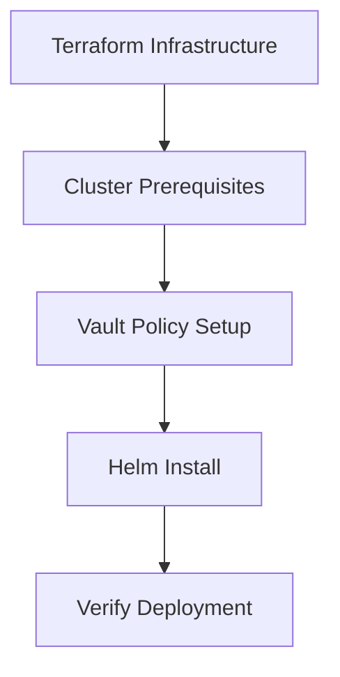

This guide covers deploying k8s-scheduler to a production Kubernetes cluster using Helm or raw manifests.

## Overview

k8s-scheduler consists of two main components:

- **Server**: Go backend serving REST API and React SPA
- **Operator**: Kubernetes operator managing UserDeployment custom resources

## Deployment Flow



### Infrastructure Layers

| Layer | Components |
|-------|------------|
| **1-infrastructure/** | VPC, EKS, RDS PostgreSQL, Vault, Tailscale |
| **2-platform/** | ALB Controller, cert-manager, External Secrets Operator |
| **3-apps/** | Traefik, external-dns, ArgoCD, Vault secrets |

See the [opsnorth/infra](https://github.com/opsnorth/infra) repository for full Terraform configuration.

## Prerequisites

Before deploying k8s-scheduler, ensure the following components are installed:

<AccordionGroup>
  <Accordion title="Required Components" icon="check">
    - **PostgreSQL** - Database for users, orgs, teams, deployments
    - **AWS ALB Controller** - Creates ALB from Ingress resources (on AWS)
    - **Traefik** - Routes wildcard traffic to user deployments
    - **External DNS** - Auto-creates DNS records from ingress
    - **cert-manager** - TLS certificates for server and deployments
    - **Cloudflare** - DNS provider for External DNS and cert-manager
  </Accordion>

  <Accordion title="Recommended Components" icon="star">
    - **HashiCorp Vault** - Centralized secrets management
    - **External Secrets Operator** - Syncs Vault secrets to K8s Secrets
    - **Vault Agent Injector** - Injects secrets into server pod
  </Accordion>

  <Accordion title="Optional Components" icon="puzzle">
    - **Stripe** - Subscription billing
    - **SendGrid/SMTP** - Team invitation emails
  </Accordion>
</AccordionGroup>

Verify all components are running:

```bash
# AWS Load Balancer Controller
kubectl get pods -n kube-system | grep aws-load-balancer

# External Secrets Operator
kubectl get pods -n external-secrets

# Vault + Agent Injector
kubectl get pods -n vault

# Traefik
kubectl get pods -n traefik

# cert-manager
kubectl get pods -n cert-manager

# external-dns
kubectl get pods -n external-dns
```

## Step 1: Configure Terraform

<Steps>
  <Step title="Clone infrastructure repository">
    ```bash
    git clone https://github.com/opsnorth/infra.git
    cd infra
    ```
  </Step>

  <Step title="Copy environment template">
    ```bash
    cp .env.example .env
    ```

    The `.env` file contains all secrets and credentials (gitignored).
  </Step>

  <Step title="Configure secrets">
    Edit `.env` with your credentials:

    ```bash .env
    # Tailscale VPN
    export TF_VAR_tailscale_auth_key="tskey-auth-..."

    # Cloudflare DNS
    export TF_VAR_cloudflare_api_token="..."

    # GitHub App (for ArgoCD)
    export TF_VAR_github_app_id="..."
    export TF_VAR_github_app_installation_id="..."
    export TF_VAR_github_app_private_key_file="~/.github/github-app.pem"

    # Google OAuth
    export TF_VAR_google_client_id="your-client-id.apps.googleusercontent.com"
    export TF_VAR_google_client_secret="your-client-secret"
    ```
  </Step>

  <Step title="Deploy infrastructure">
    ```bash
    ./deploy.sh
    ```

    This script sources `.env` and applies Terraform for all three layers.
  </Step>
</Steps>

## Step 2: Setup Vault Policy

<Warning>
  This is a **one-time setup**. Required before deploying the application.
</Warning>

The setup script creates:
- **Vault policy** `k8s-scheduler` - grants access to user secret paths
- **Kubernetes auth role** `k8s-scheduler` - binds policy to service account

```bash
./scripts/setup-vault.sh
```

**Prerequisite**: Create `~/.vault-secrets/vault.env` with your Vault token:

```bash ~/.vault-secrets/vault.env
VAULT_TOKEN=hvs.your-vault-root-token
```

### Vault Secret Paths

Terraform writes these paths automatically:

| Path | Keys | Required? |
|------|------|----------|
| `secret/k8s-scheduler/database` | `connection_string` | Yes |
| `secret/k8s-scheduler/google` | `client_id`, `client_secret` | Yes (unless DEV_MODE) |
| `secret/k8s-scheduler/email` | `provider`, `smtp_host`, `smtp_port`, `smtp_user`, `smtp_password`, `smtp_from` | No |
| `secret/k8s-scheduler/ai` | `anthropic_api_key` | No |
| `secret/k8s-scheduler/stripe` | `api_key`, `webhook_secret` | No |
| `secret/k8s-scheduler/secrets` | `keycloak_admin_password`, `grafana_cloud_prometheus_password`, `grafana_cloud_loki_password` | No |

<Note>
  All paths must exist in Vault even if empty. The Vault Agent template will fail if a path is missing.

  ```bash
  vault kv put secret/k8s-scheduler/ai anthropic_api_key=""
  vault kv put secret/k8s-scheduler/stripe api_key="" webhook_secret=""
  ```
</Note>

## Step 3: Deploy with Helm

### Install

```bash
helm install k8s-scheduler ./charts/k8s-scheduler \
  -n scheduler-system --create-namespace \
  --set domain=yourdomain.com
```

The Helm chart deploys:
- Custom Resource Definitions (UserDeployment, AgentTask, Workflow)
- RBAC (ServiceAccounts, ClusterRole, ClusterRoleBinding)
- Server deployment with Vault Agent sidecar
- Operator deployment
- ClusterSecretStore for External Secrets Operator
- Ingress (ALB) for the server
- ConfigMaps for templates

### Helm Values

View all available configuration options:

```bash
helm show values ./charts/k8s-scheduler
```

<CodeGroup>
  ```bash Minimal (required)
  helm install k8s-scheduler ./charts/k8s-scheduler \
    -n scheduler-system --create-namespace \
    --set domain=yourdomain.com
  ```

  ```bash Custom image registry
  helm install k8s-scheduler ./charts/k8s-scheduler \
    -n scheduler-system --create-namespace \
    --set domain=yourdomain.com \
    --set image.server.repository=your-registry/k8s-scheduler-server \
    --set image.operator.repository=your-registry/k8s-scheduler-operator
  ```

  ```bash Specific version
  helm install k8s-scheduler ./charts/k8s-scheduler \
    -n scheduler-system --create-namespace \
    --set domain=yourdomain.com \
    --set image.server.tag=v1.2.3 \
    --set image.operator.tag=v1.2.3
  ```

  ```bash Without Vault
  helm install k8s-scheduler ./charts/k8s-scheduler \
    -n scheduler-system --create-namespace \
    --set domain=yourdomain.com \
    --set vault.agentInject=false \
    --set vault.enabled=false \
    --set secretStore.enabled=false
  ```
</CodeGroup>

### Key Helm Values

| Value | Description | Default |
|-------|-------------|--------|
| `domain` | **Required.** Base domain for the app | `example.com` |
| `image.server.repository` | Server container image | `ghcr.io/opsnorth/k8s-scheduler-server` |
| `image.operator.repository` | Operator container image | `ghcr.io/opsnorth/k8s-scheduler-operator` |
| `image.server.tag` | Server image tag | `latest` |
| `server.replicas` | Server pod count | `1` |
| `operator.replicas` | Operator pod count | `1` |
| `operator.leaderElect` | Enable leader election for HA | `true` |
| `ingress.enabled` | Create ALB Ingress | `true` |
| `ingress.className` | Ingress class | `alb` |
| `vault.agentInject` | Enable Vault Agent sidecar | `true` |
| `vault.address` | Vault server URL | `http://vault.vault.svc.cluster.local:8200` |
| `secretStore.enabled` | Create ClusterSecretStore | `true` |
| `secretStore.name` | ClusterSecretStore name | `vault-backend` |
| `session.backend` | Session storage backend | `postgres` |

## Step 4: Deploy with Raw Manifests

<Note>
  Helm is the recommended deployment method. Use raw manifests only for advanced customization.
</Note>

```bash
kubectl apply -k manifests/
```

Manifests are organized by component:

```
manifests/
├── namespace.yaml
├── crds/
│   ├── userdeployment-crd.yaml
│   ├── agenttask-crd.yaml
│   └── workflow-crd.yaml
├── rbac/
│   ├── service-account.yaml
│   ├── server-service-account.yaml
│   ├── cluster-role.yaml
│   └── cluster-role-binding.yaml
├── configmaps/
│   ├── server-config.yaml
│   └── deployment-templates.yaml
├── secrets/
│   └── cluster-secret-store.yaml
├── deployments/
│   ├── server.yaml
│   └── operator.yaml
└── kustomization.yaml
```

## Step 5: Verify Deployment

<Steps>
  <Step title="Check pod status">
    ```bash
    kubectl get pods -n scheduler-system
    ```

    Expected output:
    ```
    NAME                                      READY   STATUS    RESTARTS   AGE
    k8s-scheduler-operator-xxxxx-xxxxx        1/1     Running   0          30s
    k8s-scheduler-server-xxxxx-xxxxx          2/2     Running   0          30s
    ```

    <Info>
      The server pod shows `2/2` because Vault Agent runs as a sidecar.
    </Info>
  </Step>

  <Step title="Check server logs">
    ```bash
    kubectl logs -n scheduler-system -l app=k8s-scheduler-server -c server --tail=50
    ```
  </Step>

  <Step title="Check operator logs">
    ```bash
    kubectl logs -n scheduler-system -l app=k8s-scheduler-operator --tail=50
    ```
  </Step>

  <Step title="Access the application">
    Application is available at:
    ```
    https://app.<your-domain>
    ```
  </Step>
</Steps>

## Testing

Create a test deployment to verify the operator:

```yaml test-deployment.yaml
apiVersion: scheduler.opsnorth.io/v1alpha1
kind: UserDeployment
metadata:
  name: test-deployment
  namespace: scheduler-system
spec:
  userId: "test-user"
  template: "nginx"
  tier: "free"
  desiredState: "running"
```

```bash
# Create
kubectl apply -f test-deployment.yaml

# Watch status
kubectl get userdeployment test-deployment -n scheduler-system -w

# Cleanup
kubectl delete userdeployment test-deployment -n scheduler-system
```

## Lifecycle Management

### Upgrade

```bash
helm upgrade k8s-scheduler ./charts/k8s-scheduler \
  -n scheduler-system \
  --set domain=yourdomain.com
```

### Rollback

```bash
# List revisions
helm history k8s-scheduler -n scheduler-system

# Rollback to specific revision
helm rollback k8s-scheduler <revision> -n scheduler-system
```

### Uninstall

```bash
# Remove Helm release + CRDs + namespace
./scripts/uninstall.sh

# Full teardown including Vault policy
./scripts/uninstall.sh --all
```

## Production Considerations

<CardGroup cols={2}>
  <Card title="High Availability" icon="server">
    Increase replicas for server and operator:
    ```bash
    --set server.replicas=3 \
    --set operator.replicas=2 \
    --set operator.leaderElect=true
    ```
  </Card>

  <Card title="Resource Limits" icon="gauge">
    Adjust based on load:
    ```yaml values.yaml
    server:
      resources:
        requests:
          cpu: 500m
          memory: 512Mi
        limits:
          cpu: 2000m
          memory: 2Gi
    ```
  </Card>

  <Card title="Database" icon="database">
    Use managed PostgreSQL:
    - AWS RDS
    - Google Cloud SQL
    - Azure Database for PostgreSQL
    
    Enable SSL connections in production.
  </Card>

  <Card title="Session Store" icon="cookie">
    Use persistent session backend:
    ```bash
    --set session.backend=postgres
    # or
    --set session.backend=redis
    ```
    
    Avoid `memory` backend in production.
  </Card>

  <Card title="TLS Certificates" icon="lock">
    cert-manager auto-provisions TLS:
    - Server ingress
    - User deployment ingresses
    
    Configure DNS01 challenge with Cloudflare.
  </Card>

  <Card title="Monitoring" icon="chart-line">
    Enable Prometheus metrics:
    ```bash
    --set monitoring.enabled=true
    ```
    
    Requires Prometheus Operator.
  </Card>
</CardGroup>

## Troubleshooting

<AccordionGroup>
  <Accordion title="Server pod won't start" icon="triangle-exclamation">
    **Symptoms**: Server pod stuck in `Init:0/1` or `CrashLoopBackOff`

    **Causes**:
    1. Vault secrets missing or incorrect
    2. Database connection failed
    3. Vault Agent can't authenticate

    **Solutions**:
    ```bash
    # Check Vault Agent logs
    kubectl logs -n scheduler-system -l app=k8s-scheduler-server -c vault-agent

    # Verify Vault secrets exist
    vault kv get secret/k8s-scheduler/database
    vault kv get secret/k8s-scheduler/google

    # Check database connectivity
    kubectl run -it --rm psql --image=postgres:15 -- psql $DATABASE_DSN
    ```
  </Accordion>

  <Accordion title="Operator not creating resources" icon="gears">
    **Symptoms**: UserDeployment created but no pods/services appear

    **Causes**:
    1. RBAC permissions missing
    2. Operator not running
    3. CRD not installed

    **Solutions**:
    ```bash
    # Check operator logs
    kubectl logs -n scheduler-system -l app=k8s-scheduler-operator

    # Verify CRD exists
    kubectl get crd userdeployments.scheduler.opsnorth.io

    # Check ClusterRole
    kubectl get clusterrole k8s-scheduler-operator
    ```
  </Accordion>

  <Accordion title="Ingress not getting external IP" icon="globe">
    **Symptoms**: Ingress created but no ALB provisioned

    **Causes**:
    1. AWS Load Balancer Controller not running
    2. Incorrect ingress annotations
    3. IAM permissions missing

    **Solutions**:
    ```bash
    # Check ALB controller logs
    kubectl logs -n kube-system -l app.kubernetes.io/name=aws-load-balancer-controller

    # Verify ingress
    kubectl describe ingress -n scheduler-system k8s-scheduler-server

    # Check ALB controller IAM role
    kubectl get sa -n kube-system aws-load-balancer-controller -o yaml
    ```
  </Accordion>

  <Accordion title="External Secrets not syncing" icon="key">
    **Symptoms**: ExternalSecret shows `SecretSyncedError`

    **Causes**:
    1. ClusterSecretStore misconfigured
    2. Vault auth role missing
    3. Secret path doesn't exist in Vault

    **Solutions**:
    ```bash
    # Check ClusterSecretStore
    kubectl get clustersecretstore vault-backend -o yaml

    # Verify Vault auth role
    vault read auth/kubernetes/role/k8s-scheduler

    # Check ESO logs
    kubectl logs -n external-secrets -l app.kubernetes.io/name=external-secrets
    ```
  </Accordion>
</AccordionGroup>

## Next Steps

<CardGroup cols={2}>
  <Card title="Configuration" icon="sliders" href="/k8s-scheduler/configuration">
    Configure environment variables and settings
  </Card>
  
  <Card title="Dependencies" icon="puzzle-piece" href="/k8s-scheduler/dependencies">
    Learn about platform dependencies
  </Card>
</CardGroup>
