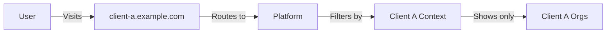
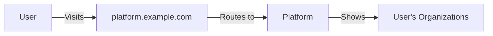

## Overview

The K8s Scheduler implements a sophisticated multi-tenancy model that supports white-label clients, organizations, teams, and individual users with role-based access control at each level.

## Hierarchy Structure

```
PLATFORM (Your Instance)
         │
         ├─── Client A (White-label)
         │    │   - Custom domain
         │    │   - Own branding
         │    │   - Billing plans
         │    │
         │    ├── Organization 1
         │    │   ├── Team A (Backend)
         │    │   │   ├── dev@company.com (developer)
         │    │   │   └── admin@company.com (team_admin)
         │    │   └── Team B (Frontend)
         │    │       └── designer@company.com (viewer)
         │    └── Organization 2
         │
         ├─── Client B (White-label)
         │    ├── Organization 3
         │    └── Organization 4
         │
         └─── Direct Organizations (No client)
              └── Organization 5
                  ├── Team X
                  └── Team Y
```

## Tenancy Levels

### Platform Level

The top-level instance of K8s Scheduler that hosts all clients and organizations.

<Tip>
A single platform instance can serve multiple white-label clients, each with their own branding, domains, and billing configurations.
</Tip>

### Client Level (Optional)

White-label clients enable you to provide branded experiences to different customers:

- **Custom domains** - Each client can have their own domain
- **Custom branding** - Logo, colors, and styling per client
- **Billing plans** - Client-specific subscription tiers
- **Isolation** - Clients cannot see each other's data

**Example use cases:**
- SaaS providers offering white-label deployment platforms
- Managed service providers serving multiple enterprise customers
- Platform companies with multiple product brands

### Organization Level

Organizations are the primary tenant unit:

- **Owned by users** - Each organization has an owner
- **Contains teams** - Organizations can create multiple teams
- **Billing entity** - Subscriptions are tied to organizations
- **Resource limits** - Deployment and team limits based on subscription tier

### Team Level

Teams provide granular access control within organizations:

- **Project isolation** - Deployments are scoped to teams
- **Member management** - Add/remove members with specific roles
- **Invitation system** - Email-based invites with role assignment
- **Template sharing** - Team-level templates visible to all members

## Access Patterns

### With White-Label Client



### Direct Organization Access



## Data Isolation

### Database Level

All data is filtered by client and organization context:

```sql
-- Example: Fetching deployments always includes org check
SELECT * FROM deployments 
WHERE organization_id = $1 
  AND team_id = $2
  AND user_id = $3;
```

### Kubernetes Level

Each user gets isolated namespaces:

```yaml
apiVersion: v1
kind: Namespace
metadata:
  name: sandbox-{userId}
  labels:
    user-id: "{userId}"
    org-id: "{orgId}"
    team-id: "{teamId}"
```

<Note>
Namespace naming follows the pattern `sandbox-{userId}` by default. This can be configured via the `KUBERNETES_NAMESPACE` environment variable.
</Note>

### Network Level

NetworkPolicies enforce isolation between tenants:

```yaml
apiVersion: networking.k8s.io/v1
kind: NetworkPolicy
metadata:
  name: deny-other-users
  namespace: sandbox-{userId}
spec:
  podSelector: {}
  policyTypes:
  - Ingress
  ingress:
  - from:
    - namespaceSelector:
        matchLabels:
          user-id: "{userId}"
```

## Multi-Tenancy Features

### Tenant Visibility

<AccordionGroup>
  <Accordion title="What can users see?">
    - Their own organizations (where they are members)
    - Teams they belong to
    - Deployments within their teams
    - Templates shared at their visibility level
    - Secrets they have created or have access to
  </Accordion>

  <Accordion title="What can organization admins see?">
    - All teams in their organization
    - All members across teams
    - Organization-level templates
    - Organization billing and subscription details
  </Accordion>

  <Accordion title="What can team admins see?">
    - All team members
    - All team deployments
    - Team-level templates
    - Team invitations and pending members
  </Accordion>
</AccordionGroup>

### Resource Quotas

Subscription tiers control resource limits:

| Feature | Free | Business | Enterprise |
|---------|------|----------|------------|
| **Deployments** | 1 | 5 | Unlimited |
| **Team Members** | 1 | 10 | Unlimited |
| **Templates** | System only | + Custom | + Org-wide |
| **Network Isolation** | Shared | Namespace | Dedicated |
| **Support** | Community | Email | Dedicated |

<Info>
Tier limits are enforced at the API level before resources are created. Exceeding limits returns a `403 Forbidden` response.
</Info>

## Creating Organizations

Organizations are automatically created when a user first signs up:

```go
// internal/server/rbac_handlers.go
func (s *Server) createDefaultOrg(user *db.User) error {
    org := &db.Organization{
        Name:    user.Email + "'s Organization",
        OwnerID: user.ID,
    }
    
    if err := s.db.CreateOrganization(org); err != nil {
        return err
    }
    
    // Add user as org member with owner role
    return s.db.AddOrganizationMember(org.ID, user.ID, "org_owner")
}
```

## Creating Teams

Organization admins can create teams:

```bash
curl -X POST https://api.example.com/api/orgs/{orgId}/teams \
  -H "Authorization: Bearer $TOKEN" \
  -H "Content-Type: application/json" \
  -d '{
    "name": "Backend Team",
    "description": "Backend developers"
  }'
```

Response:

```json
{
  "id": "team_abc123",
  "name": "Backend Team",
  "description": "Backend developers",
  "organization_id": "org_xyz789",
  "created_at": "2024-01-15T10:30:00Z"
}
```

## Managing Team Members

### Inviting Members

Team admins can invite users via email:

```bash
curl -X POST https://api.example.com/api/orgs/{orgId}/teams/{teamId}/invites \
  -H "Authorization: Bearer $TOKEN" \
  -H "Content-Type: application/json" \
  -d '{
    "email": "developer@company.com",
    "role": "developer"
  }'
```

<Note>
Invited users receive an email with a signup link. Once they authenticate, they're automatically added to the team.
</Note>

### Changing Roles

Update a member's role:

```bash
curl -X PUT https://api.example.com/api/orgs/{orgId}/teams/{teamId}/members/{userId} \
  -H "Authorization: Bearer $TOKEN" \
  -H "Content-Type: application/json" \
  -d '{
    "role": "team_admin"
  }'
```

### Removing Members

```bash
curl -X DELETE https://api.example.com/api/orgs/{orgId}/teams/{teamId}/members/{userId} \
  -H "Authorization: Bearer $TOKEN"
```

## White-Label Configuration

### Creating a Client

Platform administrators can create white-label clients:

```sql
INSERT INTO clients (name, domain, branding_config, created_at)
VALUES (
  'Acme Corp',
  'acme.example.com',
  '{"logo": "https://cdn.example.com/acme-logo.png", "primary_color": "#FF5733"}',
  NOW()
);
```

### Client-Specific Routing

The server identifies clients by domain:

```go
// internal/server/server.go
func (s *Server) identifyClient(r *http.Request) (*db.Client, error) {
    host := r.Host
    
    client, err := s.db.GetClientByDomain(host)
    if err != nil {
        // No client found - direct platform access
        return nil, nil
    }
    
    return client, nil
}
```

## Best Practices

<CardGroup cols={2}>
  <Card title="Use Teams for Projects" icon="users">
    Create separate teams for different projects or applications to maintain clear boundaries and access control.
  </Card>
  
  <Card title="Assign Appropriate Roles" icon="shield-check">
    Follow the principle of least privilege. Grant users only the permissions they need.
  </Card>
  
  <Card title="Regular Audits" icon="magnifying-glass">
    Periodically review team memberships and remove inactive users to maintain security.
  </Card>
  
  <Card title="Document Team Purpose" icon="book">
    Use team descriptions to clarify the purpose and scope of each team for new members.
  </Card>
</CardGroup>

## Related Documentation

<CardGroup cols={2}>
  <Card title="RBAC" icon="lock" href="/k8s-scheduler/rbac">
    Learn about role-based access control and permissions
  </Card>
  
  <Card title="Templates" icon="file-code" href="/k8s-scheduler/templates">
    Understand template visibility and sharing
  </Card>
  
  <Card title="API - Organizations" icon="building" href="/k8s-scheduler/api/organizations">
    Organization and team management API reference
  </Card>
  
  <Card title="Configuration" icon="gear" href="/k8s-scheduler/configuration">
    Environment variables and configuration options
  </Card>
</CardGroup>
