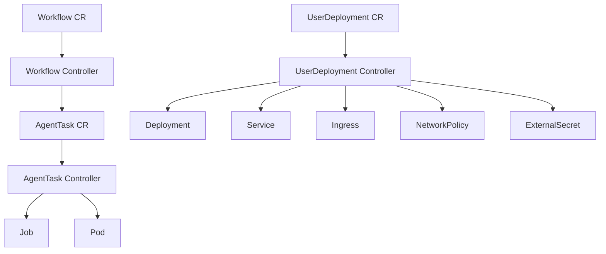

## Overview

The K8s Scheduler operator is a Kubernetes controller that reconciles custom resources (CRDs) for user deployments, ephemeral agent tasks, and multi-step workflows. It uses controller-runtime and follows Kubernetes operator best practices.

## Architecture



## Operator Entry Point

The operator is initialized in `cmd/operator/main.go`:

```go title="cmd/operator/main.go:33-155"
func main() {
	var metricsAddr string
	var enableLeaderElection bool
	var probeAddr string
	var deploymentDomain string
	var clusterSecretStoreName string
	var taskNamespace string

	flag.StringVar(&metricsAddr, "metrics-bind-address", "0", "The address the metric endpoint binds to. Set to 0 to disable.")
	flag.StringVar(&probeAddr, "health-probe-bind-address", ":8081", "The address the probe endpoint binds to.")
	flag.BoolVar(&enableLeaderElection, "leader-elect", false,
		"Enable leader election for controller manager. "+
			"Enabling this will ensure there is only one active controller manager.")
	flag.StringVar(&deploymentDomain, "deployment-domain", getEnv("DEPLOYMENT_DOMAIN", "opsnorth.io"),
		"Domain for deployment ingresses (e.g., opsnorth.io)")
	flag.StringVar(&clusterSecretStoreName, "cluster-secret-store", getEnv("CLUSTER_SECRET_STORE", ""),
		"Name of the ClusterSecretStore for external secrets")
	flag.StringVar(&taskNamespace, "task-namespace", getEnv("TASK_NAMESPACE", "agent-tasks"),
		"Namespace where agent tasks run")
	flag.Parse()

	// Setup logging
	opts := zap.Options{
		Development: true,
	}
	ctrl.SetLogger(zap.New(zap.UseFlagOptions(&opts)))

	logger := logging.New()

	logger.Info("starting scheduler operator",
		slog.String("domain", deploymentDomain),
		slog.Bool("leader-election", enableLeaderElection))

	// Create manager
	mgr, err := ctrl.NewManager(ctrl.GetConfigOrDie(), ctrl.Options{
		Scheme:                 scheme,
		Metrics:                metricsserver.Options{BindAddress: metricsAddr},
		HealthProbeBindAddress: probeAddr,
		LeaderElection:         enableLeaderElection,
		LeaderElectionID:       "scheduler-operator.opsnorth.io",
	})
	if err != nil {
		logger.Error("unable to start manager", slog.Any("error", err))
		os.Exit(1)
	}

	// Get Kubernetes config
	config := mgr.GetConfig()

	// Create Kubernetes clientset
	clientset, err := kubernetes.NewForConfig(config)
	if err != nil {
		logger.Error("unable to create kubernetes clientset", slog.Any("error", err))
		os.Exit(1)
	}

	// Create dynamic client for Traefik IngressRoutes
	dynamicClient, err := dynamic.NewForConfig(config)
	if err != nil {
		logger.Error("unable to create dynamic client", slog.Any("error", err))
		os.Exit(1)
	}

	// Check if network policies should be disabled (for local dev)
	disableNetPol := os.Getenv("DISABLE_NETWORK_POLICIES") == "true"
	if disableNetPol {
		logger.Warn("network policies disabled (DISABLE_NETWORK_POLICIES=true)")
	}

	// Setup UserDeployment controller (traditional long-lived deployments)
	if err = (&controller.UserDeploymentReconciler{
		Client:                 mgr.GetClient(),
		Scheme:                 mgr.GetScheme(),
		K8sClientset:           clientset,
		DynamicClient:          dynamicClient,
		Logger:                 logger,
		DeploymentDomain:       deploymentDomain,
		ClusterSecretStoreName: clusterSecretStoreName,
		DisableNetworkPolicies: disableNetPol,
	}).SetupWithManager(mgr); err != nil {
		logger.Error("unable to create UserDeployment controller", slog.Any("error", err))
		os.Exit(1)
	}

	// Setup AgentTask controller (ephemeral agent execution)
	if err = (&controller.AgentTaskReconciler{
		Client:    mgr.GetClient(),
		Clientset: clientset,
		Scheme:    mgr.GetScheme(),
		Logger:    logger,
		Namespace: taskNamespace,
	}).SetupWithManager(mgr); err != nil {
		logger.Error("unable to create AgentTask controller", slog.Any("error", err))
		os.Exit(1)
	}

	// Setup Workflow controller (sequential multi-step execution)
	if err = (&controller.WorkflowReconciler{
		Client:    mgr.GetClient(),
		Scheme:    mgr.GetScheme(),
		Logger:    logger,
		Namespace: taskNamespace,
	}).SetupWithManager(mgr); err != nil {
		logger.Error("unable to create Workflow controller", slog.Any("error", err))
		os.Exit(1)
	}

	// Add health checks
	if err := mgr.AddHealthzCheck("healthz", healthz.Ping); err != nil {
		logger.Error("unable to set up health check", slog.Any("error", err))
		os.Exit(1)
	}
	if err := mgr.AddReadyzCheck("readyz", healthz.Ping); err != nil {
		logger.Error("unable to set up ready check", slog.Any("error", err))
		os.Exit(1)
	}

	logger.Info("starting manager")
	if err := mgr.Start(ctrl.SetupSignalHandler()); err != nil {
		logger.Error("problem running manager", slog.Any("error", err))
		os.Exit(1)
	}
}
```

Source: `cmd/operator/main.go:33-155`

## Custom Resource Definitions

The operator manages three CRDs defined in `internal/operator/apis/scheduler/v1alpha1/types.go`:

### UserDeployment CRD

Represents a user's long-lived deployment (web app, API, database, etc.).

```go title="internal/operator/apis/scheduler/v1alpha1/types.go:16-23"
// UserDeployment is a user's sandbox deployment
type UserDeployment struct {
	metav1.TypeMeta   `json:",inline"`
	metav1.ObjectMeta `json:"metadata,omitempty"`

	Spec   UserDeploymentSpec   `json:"spec"`
	Status UserDeploymentStatus `json:"status,omitempty"`
}
```

Source: `internal/operator/apis/scheduler/v1alpha1/types.go:16-23`

#### Spec Fields

```go title="internal/operator/apis/scheduler/v1alpha1/types.go:25-74"
type UserDeploymentSpec struct {
	// UserID is the ID of the user who owns this deployment
	UserID string `json:"userId"`

	// Template is the deployment template to use
	Template string `json:"template"`

	// Tier is the user's subscription level
	Tier string `json:"tier"`

	// DesiredState indicates if deployment should be running or deleted
	DesiredState string `json:"desiredState,omitempty"`

	// Secrets configures external secrets for this deployment
	Secrets *SecretsConfig `json:"secrets,omitempty"`

	// ConfigData contains user-provided key-value pairs to be stored in a ConfigMap
	// and mounted as environment variables in the deployment
	ConfigData map[string]string `json:"configData,omitempty"`

	// ConfigFile contains configuration for mounting a file from a ConfigMap (deprecated, use ConfigFiles)
	ConfigFile *ConfigFileSpec `json:"configFile,omitempty"`

	// ConfigFiles contains an array of config files to mount from ConfigMaps
	ConfigFiles []ConfigFileSpec `json:"configFiles,omitempty"`

	// ServiceConfigData contains per-service key-value pairs to be stored in ConfigMaps
	// Key is the service name, value is a map of config key-value pairs
	ServiceConfigData map[string]map[string]string `json:"serviceConfigData,omitempty"`

	// ServiceConfigFiles contains per-service config files to mount from ConfigMaps
	// Key is the service name, value is an array of config files
	ServiceConfigFiles map[string][]ConfigFileSpec `json:"serviceConfigFiles,omitempty"`

	// Replicas is the number of replicas for the deployment (overrides template default)
	Replicas int32 `json:"replicas,omitempty"`

	// Visibility determines if the deployment is public (internet-facing) or internal (VPN-only)
	// public: accessible via *.opsnorth.io (internet-facing ALB)
	// internal: accessible via *.int.opsnorth.io (internal ALB, VPN required)
	// Defaults to "public" for backward compatibility
	Visibility string `json:"visibility,omitempty"`

	// Image is a raw container image to deploy (bypasses template lookup)
	Image string `json:"image,omitempty"`

	// ContainerPort is the port the container listens on (used with Image)
	ContainerPort int32 `json:"containerPort,omitempty"`
}
```

Source: `internal/operator/apis/scheduler/v1alpha1/types.go:25-74`

#### Status Fields

```go title="internal/operator/apis/scheduler/v1alpha1/types.go:119-135"
type UserDeploymentStatus struct {
	// Phase is the current state of the deployment
	Phase string `json:"phase,omitempty"`

	// LastError contains the last error message if phase is error
	LastError string `json:"lastError,omitempty"`

	// Ingresses are the URLs where the deployment is accessible
	Ingresses []IngressInfo `json:"ingresses,omitempty"`

	// LastReconcile is the timestamp of the last reconciliation
	LastReconcile *metav1.Time `json:"lastReconcile,omitempty"`

	// ObservedGeneration is the generation observed by the controller
	ObservedGeneration int64 `json:"observedGeneration,omitempty"`
}
```

Source: `internal/operator/apis/scheduler/v1alpha1/types.go:119-135`

#### Phase Constants

```go title="internal/operator/apis/scheduler/v1alpha1/types.go:152-159"
const (
	PhasePending      = "pending"
	PhaseProvisioning = "provisioning"
	PhaseReady        = "ready"
	PhaseError        = "error"
	PhaseDeleting     = "deleting"
)
```

Source: `internal/operator/apis/scheduler/v1alpha1/types.go:152-159`

### AgentTask CRD

Represents an ephemeral agent execution (short-lived task).

```go title="internal/operator/apis/scheduler/v1alpha1/types.go:190-197"
type AgentTask struct {
	metav1.TypeMeta   `json:",inline"`
	metav1.ObjectMeta `json:"metadata,omitempty"`

	Spec   AgentTaskSpec   `json:"spec"`
	Status AgentTaskStatus `json:"status,omitempty"`
}
```

Source: `internal/operator/apis/scheduler/v1alpha1/types.go:190-197`

#### AgentTask Spec

```go title="internal/operator/apis/scheduler/v1alpha1/types.go:199-227"
type AgentTaskSpec struct {
	// TaskID is the database task ID for status updates
	TaskID string `json:"taskId"`

	// UserID is the ID of the user who owns this task
	UserID string `json:"userId"`

	// Image is the container image to run
	Image string `json:"image"`

	// Input is the input data passed to the task as environment variables
	Input map[string]string `json:"input,omitempty"`

	// Timeout is the maximum execution time in seconds (0 = no timeout)
	TimeoutSeconds int64 `json:"timeoutSeconds,omitempty"`

	// Resources specifies CPU and memory requests/limits
	Resources *AgentTaskResources `json:"resources,omitempty"`

	// WebhookURL is the URL to call on task completion
	WebhookURL string `json:"webhookUrl,omitempty"`

	// ServiceAccountName is the service account to use for the Job
	ServiceAccountName string `json:"serviceAccountName,omitempty"`

	// ImagePullSecrets for private registries
	ImagePullSecrets []string `json:"imagePullSecrets,omitempty"`
}
```

Source: `internal/operator/apis/scheduler/v1alpha1/types.go:199-227`

### Workflow CRD

Orchestrates sequential multi-step agent executions.

```go title="internal/operator/apis/scheduler/v1alpha1/types.go:550-556"
type Workflow struct {
	metav1.TypeMeta   `json:",inline"`
	metav1.ObjectMeta `json:"metadata,omitempty"`

	Spec   WorkflowSpec   `json:"spec"`
	Status WorkflowStatus `json:"status,omitempty"`
}
```

Source: `internal/operator/apis/scheduler/v1alpha1/types.go:550-556`

## UserDeployment Controller

The UserDeployment controller reconciles user deployments by creating/updating Kubernetes resources.

### Controller Structure

```go title="internal/operator/controller/userdeployment_controller.go:64-74"
type UserDeploymentReconciler struct {
	client.Client
	Scheme                 *runtime.Scheme
	K8sClientset           kubernetes.Interface
	DynamicClient          dynamic.Interface
	Logger                 *slog.Logger
	DeploymentDomain       string
	ClusterSecretStoreName string
	DisableNetworkPolicies bool // Skip network policy creation (for local dev)
}
```

Source: `internal/operator/controller/userdeployment_controller.go:64-74`

### Reconciliation Loop

```go title="internal/operator/controller/userdeployment_controller.go:281-310"
func (r *UserDeploymentReconciler) Reconcile(ctx context.Context, req ctrl.Request) (ctrl.Result, error) {
	logger := r.Logger.With(
		slog.String("userdeployment", req.Name),
		slog.String("namespace", req.Namespace),
	)

	// Fetch the UserDeployment instance
	var userDep schedulerv1alpha1.UserDeployment
	if err := r.Get(ctx, req.NamespacedName, &userDep); err != nil {
		if apierrors.IsNotFound(err) {
			// Object not found, could have been deleted
			logger.Info("UserDeployment not found, likely deleted")
			return ctrl.Result{}, nil
		}
		logger.Error("failed to get UserDeployment", slog.Any("error", err))
		return ctrl.Result{}, err
	}

	logger.Info("reconciling UserDeployment",
		slog.String("user_id", userDep.Spec.UserID),
		slog.String("template", userDep.Spec.Template),
		slog.String("tier", userDep.Spec.Tier),
		slog.String("phase", userDep.Status.Phase),
		slog.String("desired_state", userDep.Spec.DesiredState))
```

Source: `internal/operator/controller/userdeployment_controller.go:281-300`

### Reconciliation Steps

1. **Fetch UserDeployment CR** from Kubernetes API
2. **Check desired state**:
   - If `deleted`: Add finalizer and clean up resources
   - If `running`: Provision/update resources
3. **Load template** from ConfigMap
4. **Create namespace** (if needed)
5. **Create ConfigMaps** for user configuration
6. **Create ExternalSecrets** for secrets injection
7. **Create Deployments** for each service
8. **Create Services** for networking
9. **Create Ingresses** (Traefik IngressRoute)
10. **Create NetworkPolicies** for isolation
11. **Update status** with phase and ingress URLs

### Resource Creation

#### Deployment Creation

The controller creates Kubernetes Deployments for each service in the template:

```go
deployment := &appsv1.Deployment{
	ObjectMeta: metav1.ObjectMeta{
		Name:      deploymentName,
		Namespace: namespace,
		Labels: map[string]string{
			"app":        deploymentName,
			"service":    svc.Name,
			"user_id":    userDep.Spec.UserID,
			"managed-by": "scheduler-operator",
		},
	},
	Spec: appsv1.DeploymentSpec{
		Replicas: &replicas,
		Selector: &metav1.LabelSelector{
			MatchLabels: map[string]string{
				"app":     deploymentName,
				"service": svc.Name,
			},
		},
		Template: corev1.PodTemplateSpec{
			ObjectMeta: metav1.ObjectMeta{
				Labels: map[string]string{
					"app":     deploymentName,
					"service": svc.Name,
				},
			},
			Spec: corev1.PodSpec{
				Containers: []corev1.Container{{
					Name:  svc.Name,
					Image: svc.Image,
					Ports: buildContainerPorts(svc.GetPorts()),
					Resources: corev1.ResourceRequirements{
						Requests: corev1.ResourceList{
							corev1.ResourceCPU:    resource.MustParse(svc.Resources.Requests.CPU),
							corev1.ResourceMemory: resource.MustParse(svc.Resources.Requests.Memory),
						},
						Limits: corev1.ResourceList{
							corev1.ResourceCPU:    resource.MustParse(svc.Resources.Limits.CPU),
							corev1.ResourceMemory: resource.MustParse(svc.Resources.Limits.Memory),
						},
					},
				}},
			},
		},
	},
}
```

#### Service Creation

Kubernetes Services are created for each service:

```go
service := &corev1.Service{
	ObjectMeta: metav1.ObjectMeta{
		Name:      serviceName,
		Namespace: namespace,
		Labels: map[string]string{
			"app":        deploymentName,
			"service":    svc.Name,
			"managed-by": "scheduler-operator",
		},
	},
	Spec: corev1.ServiceSpec{
		Type: svc.GetServiceType(), // ClusterIP or LoadBalancer
		Selector: map[string]string{
			"app":     deploymentName,
			"service": svc.Name,
		},
		Ports: buildServicePorts(svc.GetPorts()),
	},
}
```

#### Ingress Creation

Traefik IngressRoutes are created for public/internal access:

```go
ingress := &unstructured.Unstructured{
	Object: map[string]interface{}{
		"apiVersion": "traefik.io/v1alpha1",
		"kind":       "IngressRoute",
		"metadata": map[string]interface{}{
			"name":      ingressName,
			"namespace": namespace,
		},
		"spec": map[string]interface{}{
			"entryPoints": []interface{}{"websecure"},
			"routes": []interface{}{
				map[string]interface{}{
					"match": fmt.Sprintf("Host(`%s.%s`)", deploymentName, domain),
					"kind":  "Rule",
					"services": []interface{}{
						map[string]interface{}{
							"name": serviceName,
							"port": ingress.Port,
						},
					},
				},
			},
			"tls": map[string]interface{}{
				"certResolver": "letsencrypt",
			},
		},
	},
}
```

### Secrets Integration

The controller creates ExternalSecret resources for Vault/AWS secrets:

```go
externalSecret := &unstructured.Unstructured{
	Object: map[string]interface{}{
		"apiVersion": "external-secrets.io/v1beta1",
		"kind":       "ExternalSecret",
		"metadata": map[string]interface{}{
			"name":      secretName,
			"namespace": namespace,
		},
		"spec": map[string]interface{}{
			"secretStoreRef": map[string]interface{}{
				"name": clusterSecretStoreName,
				"kind": "ClusterSecretStore",
			},
			"target": map[string]interface{}{
				"name":           secretName,
				"creationPolicy": "Owner",
			},
			"data": secretData,
		},
	},
}
```

### Finalizer Pattern

The controller uses finalizers for cleanup:

```go
if userDep.Spec.DesiredState == schedulerv1alpha1.DesiredStateDeleted {
	if controllerutil.ContainsFinalizer(&userDep, finalizerName) {
		// Clean up resources
		if err := r.deleteDeploymentResources(ctx, &userDep); err != nil {
			logger.Error("failed to delete resources", slog.Any("error", err))
			return ctrl.Result{}, err
		}

		// Remove finalizer
		controllerutil.RemoveFinalizer(&userDep, finalizerName)
		if err := r.Update(ctx, &userDep); err != nil {
			return ctrl.Result{}, err
		}
	}
	return ctrl.Result{}, nil
}

// Add finalizer if not present
if !controllerutil.ContainsFinalizer(&userDep, finalizerName) {
	controllerutil.AddFinalizer(&userDep, finalizerName)
	if err := r.Update(ctx, &userDep); err != nil {
		return ctrl.Result{}, err
	}
}
```

## AgentTask Controller

The AgentTask controller manages ephemeral agent executions by creating Kubernetes Jobs.

### Job Creation

The controller creates a Job for each AgentTask:

```go
job := &batchv1.Job{
	ObjectMeta: metav1.ObjectMeta{
		Name:      jobName,
		Namespace: namespace,
		Labels: map[string]string{
			"app":        "agent-task",
			"task_id":    task.Spec.TaskID,
			"user_id":    task.Spec.UserID,
			"managed-by": "scheduler-operator",
		},
	},
	Spec: batchv1.JobSpec{
		TTLSecondsAfterFinished: ptr.To(int32(3600)), // Clean up after 1 hour
		BackoffLimit:            ptr.To(int32(0)),    // No retries
		Template: corev1.PodTemplateSpec{
			Spec: corev1.PodSpec{
				RestartPolicy: corev1.RestartPolicyNever,
				Containers: []corev1.Container{{
					Name:  "agent",
					Image: task.Spec.Image,
					Env:   buildEnvVars(task.Spec.Input),
					Resources: corev1.ResourceRequirements{
						Requests: corev1.ResourceList{
							corev1.ResourceCPU:    resource.MustParse(task.Spec.Resources.CPU),
							corev1.ResourceMemory: resource.MustParse(task.Spec.Resources.Memory),
						},
					},
				}},
			},
		},
	},
}
```

### Status Syncing

The controller watches Job/Pod status and updates the AgentTask CR:

- **Pending**: Job created, waiting for Pod
- **Running**: Pod is running
- **Succeeded**: Pod completed with exit code 0
- **Failed**: Pod completed with non-zero exit code
- **Timeout**: Execution exceeded timeout limit

## Workflow Controller

The Workflow controller orchestrates sequential AgentTask executions.

### Step Execution

The controller:

1. Creates AgentTask CR for current step
2. Waits for step completion
3. Captures step output
4. Substitutes output into next step's input (supports `${steps.N.output.KEY}` syntax)
5. Advances to next step
6. Repeats until all steps complete or one fails

### Workflow Status

```go
type WorkflowStatus struct {
	Phase          string                 // Pending, Running, Succeeded, Failed
	CurrentStep    int32                  // Index of current step
	StepStatuses   []WorkflowStepStatus  // Status of each step
	StartTime      *metav1.Time
	CompletionTime *metav1.Time
	Duration       string
}
```

Source: `internal/operator/apis/scheduler/v1alpha1/types.go:592-611`

## RBAC Permissions

The operator requires these Kubernetes permissions:

```go
// +kubebuilder:rbac:groups=scheduler.opsnorth.io,resources=userdeployments,verbs=get;list;watch;create;update;patch;delete
// +kubebuilder:rbac:groups=scheduler.opsnorth.io,resources=userdeployments/status,verbs=get;update;patch
// +kubebuilder:rbac:groups=scheduler.opsnorth.io,resources=userdeployments/finalizers,verbs=update
// +kubebuilder:rbac:groups="",resources=namespaces,verbs=get;list;watch;create;update;delete
// +kubebuilder:rbac:groups="",resources=configmaps,verbs=get;list;watch;create;update;patch
// +kubebuilder:rbac:groups="",resources=secrets,verbs=get;list;watch
// +kubebuilder:rbac:groups="",resources=persistentvolumeclaims,verbs=get;list;watch;create
// +kubebuilder:rbac:groups=apps,resources=deployments,verbs=get;list;watch;create;update;patch;delete
// +kubebuilder:rbac:groups="",resources=services,verbs=get;list;watch;create;update;patch;delete
// +kubebuilder:rbac:groups=networking.k8s.io,resources=networkpolicies,verbs=get;list;watch;create;update;patch;delete
// +kubebuilder:rbac:groups=traefik.io,resources=ingressroutes,verbs=get;list;watch;create;update;patch;delete
// +kubebuilder:rbac:groups=monitoring.coreos.com,resources=servicemonitors,verbs=get;list;watch;create;update;delete
// +kubebuilder:rbac:groups=external-secrets.io,resources=externalsecrets,verbs=get;list;watch;create;update;patch;delete
```

Source: `internal/operator/controller/userdeployment_controller.go:267-279`

## Health Checks

The operator exposes health endpoints:

- `GET :8081/healthz` - Liveness probe
- `GET :8081/readyz` - Readiness probe

## Metrics

Prometheus metrics are exposed on the configured metrics port (default: disabled).

## Leader Election

The operator supports leader election for high availability:

```bash
--leader-elect=true
```

Only one instance will actively reconcile resources.

## Configuration

### Command-Line Flags

```bash
--metrics-bind-address string       Metrics endpoint address (default "0" = disabled)
--health-probe-bind-address string  Health probe address (default ":8081")
--leader-elect bool                 Enable leader election (default false)
--deployment-domain string          Domain for ingresses (default "opsnorth.io")
--cluster-secret-store string       ClusterSecretStore name for External Secrets
--task-namespace string             Namespace for agent tasks (default "agent-tasks")
```

Source: `cmd/operator/main.go:34-51`

### Environment Variables

- `DEPLOYMENT_DOMAIN` - Domain for deployment ingresses
- `CLUSTER_SECRET_STORE` - External Secrets ClusterSecretStore name
- `TASK_NAMESPACE` - Namespace for ephemeral tasks
- `DISABLE_NETWORK_POLICIES` - Skip network policy creation (dev mode)

## Deployment

The operator is deployed as a Kubernetes Deployment with:

- Service account with RBAC permissions
- Leader election for HA
- Health probes for liveness/readiness
- Metrics endpoint (optional)

## Related Documentation

<CardGroup cols={2}>
  <Card title="Frontend Architecture" href="/k8s-scheduler/frontend" icon="react">
    React 19 frontend with TypeScript and TanStack Query
  </Card>
  <Card title="Server Architecture" href="/k8s-scheduler/server" icon="server">
    Go backend with HTTP handlers and middleware
  </Card>
</CardGroup>
