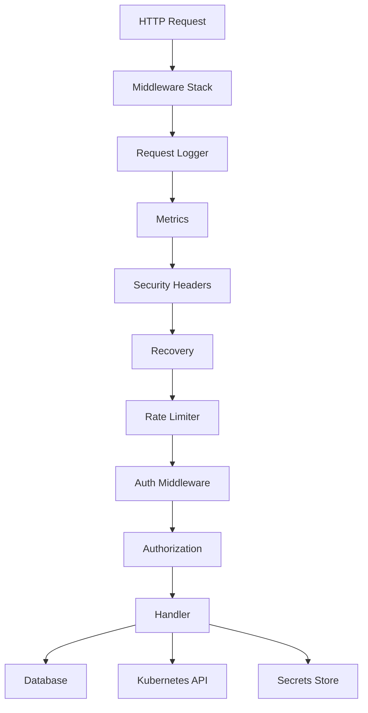

## Overview

The K8s Scheduler server is a Go HTTP server that provides the backend API for deployment management, authentication, authorization, billing, and Kubernetes integration. It uses session-based authentication, role-based access control (RBAC), and integrates with Kubernetes via the operator pattern.

## Architecture



## Server Entry Point

The server is initialized in `cmd/server/main.go` with dependency injection:

```go title="cmd/server/main.go:37-56"
func main() {
	logger := logging.New()

	// --migrate-only: run migrations and exit (used by Helm pre-upgrade Job)
	if len(os.Args) > 1 && os.Args[1] == "--migrate-only" {
		dsn := os.Getenv("DATABASE_DSN")
		if dsn == "" {
			logger.Error("DATABASE_DSN is required for migrations")
			os.Exit(1)
		}
		logger.Info("running database migrations")
		if err := db.Migrate(dsn); err != nil {
			logger.Error("migration failed", slog.Any("error", err))
			os.Exit(1)
		}
		logger.Info("migrations completed successfully")
		os.Exit(0)
	}

	cfg, err := appconfig.Load()
```

Source: `cmd/server/main.go:37-62`

### Key Initialization Steps

1. **Load configuration** from environment variables
2. **Run migrations** (if `--migrate-only` flag or `AUTO_MIGRATE=true`)
3. **Initialize OAuth provider** (Google)
4. **Open database connection** with connection pooling
5. **Initialize session store** (memory, PostgreSQL, or Redis)
6. **Create Kubernetes clients** (if enabled)
7. **Initialize secrets store** (Vault or AWS Secrets Manager)
8. **Setup billing** (Stripe integration)
9. **Start background workers** (template sync, image watcher, status syncers)

## HTTP Handler

The main HTTP handler is defined in `internal/server/server.go`:

```go title="internal/server/server.go:100-128"
// Handler wires HTTP routes to the business logic.
type Handler struct {
	cfg              config.Config
	logger           *slog.Logger
	taskNamespace    string // Namespace for ephemeral agent tasks
	sandboxNamespace string // Namespace for interactive sandboxes
	google           OAuthProvider
	stateGen         state.Generator
	stateStore       state.Store
	userStore        db.Store
	sessionStore     session.Store
	requestIDGen     state.Generator
	deployer         DeploymentManager
	mux              *http.ServeMux
	k8sClient        interface{} // controller-runtime client for operator pattern
	k8sClientset     interface{} // kubernetes.Interface for pod logs
	k8sRestConfig    interface{} // *rest.Config for pod exec
	metricsClientset interface{} // metrics.k8s.io client for pod metrics
	templateSyncer   TemplateSyncer
	secretsStore     secrets.Store
	emailSender      EmailSender
	spaHandler       *SPAHandler // React SPA handler (when ReactUI is enabled)
	aiGenerator      *ai.Generator

	// Track recently deleted deployments to show "deleting" state in UI
	deletingDeployments map[string]deletingDeployment
	deletingMu          sync.RWMutex
}
```

Source: `internal/server/server.go:100-128`

## Routing

Routes are registered in the `routes()` method:

```go title="internal/server/server.go:211-310"
func (h *Handler) routes() {
	authMiddleware := middleware.AuthMiddleware(h.sessionStore)
	auditMiddleware := middleware.AuditMiddleware(h.logger)

	// Rate limiters: auth endpoints (10 req/min), API endpoints (100 req/min)
	authRateLimiter := middleware.NewRateLimiter(10)
	apiRateLimiter := middleware.NewRateLimiter(100)

	// Combined auth middleware: supports both session and API key authentication
	combinedAuthMiddleware := middleware.CombinedAuthMiddleware(h.userStore, h.sessionStore)

	// Health check endpoints (no auth required)
	h.mux.HandleFunc("/health", h.handleHealth)
	h.mux.HandleFunc("/readyz", h.handleReady)

	// Public config endpoint (no auth required) — exposes feature flags to frontend
	h.mux.HandleFunc("/api/config", h.handleConfig)

	// Dev mode login (bypasses OAuth)
	if h.cfg.DevMode {
		h.mux.HandleFunc("/dev/login", h.handleDevLogin)
	}

	// OAuth routes (always needed, rate limited)
	h.mux.Handle("/oauth2/callback", h.applyMiddleware(authRateLimiter.Middleware(http.HandlerFunc(h.handleCallback))))
	h.mux.Handle("/logout", h.applyMiddleware(auditMiddleware(authMiddleware(http.HandlerFunc(h.handleLogout)))))

	// API routes (JSON endpoints - support both session and API key auth for programmatic access)
	deployScope := middleware.RequireMethodScope("deployments")
	templateScope := middleware.RequireMethodScope("templates")
	secretScope := middleware.RequireMethodScope("secrets")
	deployWriteScope := middleware.RequireScope("deployments:write")

	apiRL := apiRateLimiter.Middleware

	h.mux.Handle("/api/deployments", h.applyMiddleware(apiRL(auditMiddleware(combinedAuthMiddleware(deployScope(http.HandlerFunc(h.handleDeploymentsAPIRouter)))))))
	h.mux.Handle("/api/deployments/delete", h.applyMiddleware(apiRL(auditMiddleware(combinedAuthMiddleware(deployWriteScope(http.HandlerFunc(h.handleDeleteDeploymentAPI)))))))
	h.mux.Handle("/api/deployments/status", h.applyMiddleware(apiRL(auditMiddleware(combinedAuthMiddleware(middleware.RequireScope("deployments:read")(http.HandlerFunc(h.handleDeploymentStatus)))))))
	// ... more routes
}
```

Source: `internal/server/server.go:211-310`

### Route Categories

<AccordionGroup>
  <Accordion title="Health & Config">
    - `GET /health` - Health check (liveness probe)
    - `GET /readyz` - Readiness check (readiness probe)
    - `GET /api/config` - Public configuration (feature flags)
  </Accordion>

  <Accordion title="Authentication">
    - `GET /login` - Initiate OAuth flow
    - `GET /oauth2/callback` - OAuth callback handler
    - `POST /logout` - Logout and clear session
    - `GET /dev/login` - Dev mode login (bypass OAuth)
  </Accordion>

  <Accordion title="Deployments">
    - `GET /api/deployments` - List user deployments
    - `POST /api/deployments` - Create deployment
    - `POST /api/deployments/delete` - Delete deployment
    - `GET /api/deployments/status` - Get deployment status
    - `GET/PUT /api/deployments/config` - Deployment configuration
    - `POST /api/deployments/restart` - Restart deployment
    - `POST /api/deployments/deploy-image` - Deploy custom image
  </Accordion>

  <Accordion title="Templates">
    - `GET /api/templates` - List templates
    - `POST /api/templates` - Create template (admin)
    - `PUT /api/templates/:id` - Update template (admin)
    - `DELETE /api/templates/:id` - Delete template (admin)
    - `POST /api/templates/generate` - AI-generated templates
  </Accordion>

  <Accordion title="Secrets">
    - `GET /api/secrets` - List user secrets
    - `POST /api/secrets` - Create secret
    - `PUT /api/secrets/:id` - Update secret
    - `DELETE /api/secrets/:id` - Delete secret
    - `GET /api/org/secrets` - Org-wide secrets
  </Accordion>

  <Accordion title="Tasks & Workflows">
    - `GET /api/tasks` - List tasks
    - `POST /api/tasks` - Create ephemeral task
    - `GET /api/tasks/:id` - Get task status
    - `GET /api/workflows` - List workflows
    - `POST /api/workflows` - Create workflow
    - `GET /api/workflows/:id` - Get workflow status
  </Accordion>

  <Accordion title="Sandboxes">
    - `GET /api/sandboxes` - List sandboxes
    - `POST /api/sandboxes` - Create sandbox
    - `GET /api/sandboxes/:id` - Get sandbox details
    - `DELETE /api/sandboxes/:id` - Delete sandbox
  </Accordion>

  <Accordion title="RBAC & Teams">
    - `GET /api/me` - Current user info
    - `GET /api/orgs` - List user organizations
    - `POST /api/orgs` - Create organization
    - `GET /api/teams` - List teams
    - `POST /api/teams` - Create team
    - `POST /api/teams/:id/invite` - Invite team member
  </Accordion>

  <Accordion title="Billing">
    - `GET /api/billing/session` - Create Stripe checkout session
    - `POST /api/billing/webhook` - Stripe webhook
    - `GET /api/public/plans` - Available subscription plans
  </Accordion>

  <Accordion title="Admin">
    - `GET /api/admin/users` - List all users (platform admin)
    - `GET /api/admin/metrics` - Platform metrics
    - `GET /api/clients` - White-label client management
  </Accordion>
</AccordionGroup>

## Middleware Stack

The server uses a composable middleware stack defined in `internal/middleware/`:

### Core Middleware

```bash
internal/middleware/
├── auth.go           # Session-based authentication
├── apikey.go         # API key authentication
├── authz.go          # Role-based authorization
├── security.go       # Security headers (CSP, HSTS, etc.)
├── recovery.go       # Panic recovery
├── request_logger.go # Request/response logging
├── metrics.go        # Prometheus metrics
├── ratelimit.go      # Rate limiting
└── errors.go         # Error handling
```

Source: `internal/middleware/` directory

### Middleware Application

```go title="internal/server/server.go:379-396"
func (h *Handler) applyMiddleware(next http.Handler) http.Handler {
	// Apply security headers middleware
	securityCfg := middleware.DefaultSecurityConfig()
	securityMiddleware := middleware.SecurityHeaders(securityCfg)
	recoveryMiddleware := middleware.Recovery(h.logger)

	return recoveryMiddleware(securityMiddleware(http.HandlerFunc(func(w http.ResponseWriter, r *http.Request) {
		reqID := strings.TrimSpace(r.Header.Get(requestIDHeader))
		if reqID == "" {
			reqID = h.nextRequestID(r.Context())
		}

		ctx := context.WithValue(r.Context(), requestIDKey, reqID)
		w.Header().Set(requestIDHeader, reqID)

		next.ServeHTTP(w, r.WithContext(ctx))
	})))
}
```

Source: `internal/server/server.go:379-396`

### Request Flow

1. **Request Logger** - Logs all requests with status and duration
2. **Metrics** - Records Prometheus metrics
3. **Security Headers** - Adds CSP, HSTS, X-Frame-Options, etc.
4. **Recovery** - Catches panics and returns 500
5. **Request ID** - Generates/extracts correlation ID
6. **Rate Limiter** - Token bucket rate limiting
7. **Authentication** - Session or API key validation
8. **Authorization** - RBAC permission checks
9. **Handler** - Business logic

## Authentication

### Session-Based Auth

The server supports multiple session backends:

```go title="cmd/server/main.go:98-140"
var sessionStore session.Store
switch cfg.Session.Backend {
case "memory":
	logger.Info("using in-memory session store (for development only)")
	sessionStore, err = session.NewMemoryStore(session.MemoryConfig{
		SessionDuration: cfg.Session.Duration,
		CleanupInterval: cfg.Session.CleanupInterval,
		CookieName:      cfg.Session.CookieName,
		SecureCookie:    cfg.Session.SecureCookie,
		CookieDomain:    cfg.Session.CookieDomain,
	})
case "postgres":
	logger.Info("using PostgreSQL session store")
	sessionStore, err = session.NewPostgresStore(session.PostgresConfig{
		Pool:            dbStore.Pool(),
		SessionDuration: cfg.Session.Duration,
		CleanupInterval: cfg.Session.CleanupInterval,
		CookieName:      cfg.Session.CookieName,
		SecureCookie:    cfg.Session.SecureCookie,
		CookieDomain:    cfg.Session.CookieDomain,
	})
case "redis":
	logger.Info("using Redis session store", slog.String("redis_addr", cfg.Session.RedisAddr))
	sessionStore, err = session.NewRedisStore(session.RedisConfig{
		Addr:            cfg.Session.RedisAddr,
		Password:        cfg.Session.RedisPassword,
		DB:              cfg.Session.RedisDB,
		SessionDuration: cfg.Session.Duration,
		CleanupInterval: cfg.Session.CleanupInterval,
		CookieName:      cfg.Session.CookieName,
		SecureCookie:    cfg.Session.SecureCookie,
		CookieDomain:    cfg.Session.CookieDomain,
	})
default:
	logger.Error("unsupported session backend", slog.String("backend", cfg.Session.Backend))
	os.Exit(1)
}
```

Source: `cmd/server/main.go:98-140`

### OAuth Flow

1. **Login** (`/login`) - Generates state token and redirects to Google OAuth
2. **Callback** (`/oauth2/callback`) - Validates state, exchanges code for token, fetches profile
3. **User Creation** - Creates user record, assigns tier, creates org/team
4. **Session Creation** - Creates session and sets secure cookie
5. **Redirect** - Redirects to dashboard or invite page

Source: `internal/server/server.go:412-859`

### API Key Auth

API endpoints support both session and API key authentication:

```go
combinedAuthMiddleware := middleware.CombinedAuthMiddleware(h.userStore, h.sessionStore)
```

This allows programmatic access via API keys while maintaining session-based auth for the UI.

## Authorization

### RBAC System

The server implements a hierarchical RBAC system:

```
Organization
  ├── Teams (multiple)
  │   ├── Members (org_owner, team_admin, member)
  │   └── Deployments (team-scoped)
  └── Billing (org-level)
```

### Permission Scopes

```go
// Scope-based authorization
deployScope := middleware.RequireMethodScope("deployments") // Read/write based on HTTP method
deployWriteScope := middleware.RequireScope("deployments:write") // Explicit write
secretScope := middleware.RequireMethodScope("secrets")
```

Source: `internal/server/server.go:240-243`

## Database Layer

The database layer is in `internal/db/`:

```bash
internal/db/
├── store.go          # Main DB interface
├── migrate.go        # Schema migrations
├── rbac.go           # RBAC queries
├── billing.go        # Billing queries
└── whitelabel.go     # Client management
```

Source: `internal/db/` directory structure

### Database Operations

- User management
- Organization/team CRUD
- Deployment tracking
- Session storage (PostgreSQL backend)
- Billing records
- Audit logs

## Kubernetes Integration

The server integrates with Kubernetes using two client types:

### Controller-Runtime Client

For operator pattern (CRDs):

```go title="cmd/server/main.go:160-186"
// Initialize controller-runtime client for operator pattern
scheme := runtime.NewScheme()
utilruntime.Must(clientgoscheme.AddToScheme(scheme))
utilruntime.Must(schedulerv1alpha1.AddToScheme(scheme))

if cfg.Kubernetes.KubeconfigPath == "" {
	restCfg, err = rest.InClusterConfig()
	if err != nil {
		logger.Error("build in-cluster config", slog.Any("error", err))
		os.Exit(1)
	}
} else {
	restCfg, err = clientcmd.BuildConfigFromFlags("", cfg.Kubernetes.KubeconfigPath)
	if err != nil {
		logger.Error("load kubeconfig", slog.Any("error", err))
		os.Exit(1)
	}
}

k8sClient, err = client.New(restCfg, client.Options{Scheme: scheme})
if err != nil {
	logger.Error("create controller-runtime client", slog.Any("error", err))
	os.Exit(1)
}
```

Source: `cmd/server/main.go:160-186`

### Standard Clientset

For pod logs and exec:

```go
if kubeClient, ok := deployer.(*kube.Client); ok {
	handler.SetK8sClientset(kubeClient.Clientset())
	handler.SetK8sRestConfig(restCfg)
}
```

Source: `cmd/server/main.go:206-209`

## Background Workers

The server runs several background workers:

### Template Syncer

Syncs templates from database to Kubernetes ConfigMap:

```go title="cmd/server/main.go:295-307"
if k8sClient != nil {
	syncer := templatesync.New(dbStore, k8sClient, logger)
	handler.SetTemplateSyncer(syncer)

	// Seed templates from ConfigMap to database on startup
	if err := syncer.SeedFromConfigMap(ctx); err != nil {
		logger.Warn("template seeding from ConfigMap failed", slog.Any("error", err))
	}

	// Start periodic sync (every 5 minutes)
	syncer.StartPeriodicSync(ctx, 5*time.Minute)
	logger.Info("template syncer started", slog.Duration("interval", 5*time.Minute))
}
```

Source: `cmd/server/main.go:295-307`

### Image Watcher

Watches ECR for image updates and auto-updates deployments:

```go title="cmd/server/main.go:309-311"
imgWatcher := imagewatcher.New(k8sClient, logger)
imgWatcher.Start(ctx, 60*time.Second)
```

Source: `cmd/server/main.go:309-311`

### Task Status Syncer

Syncs AgentTask CR status to database:

```go title="cmd/server/main.go:313-320"
taskSyncer := server.NewTaskStatusSyncer(k8sClient, dbStore, logger, taskNamespace)
go func() {
	if err := taskSyncer.Start(ctx); err != nil && err != context.Canceled {
		logger.Error("task status syncer failed", slog.Any("error", err))
	}
}()
logger.Info("task status syncer started", slog.String("namespace", taskNamespace))
```

Source: `cmd/server/main.go:313-320`

### Workflow Status Syncer

Syncs Workflow CR status to database:

```go title="cmd/server/main.go:322-329"
workflowSyncer := server.NewWorkflowStatusSyncer(k8sClient, dbStore, logger, taskNamespace)
go func() {
	if err := workflowSyncer.Start(ctx); err != nil && err != context.Canceled {
		logger.Error("workflow status syncer failed", slog.Any("error", err))
	}
}()
logger.Info("workflow status syncer started", slog.String("namespace", taskNamespace))
```

Source: `cmd/server/main.go:322-329`

### Sandbox Status Syncer

Syncs SandboxClaim CR status to database:

```go title="cmd/server/main.go:331-344"
sandboxClientset, err := kubernetes.NewForConfig(restCfg)
if err != nil {
	logger.Error("create sandbox syncer clientset", slog.Any("error", err))
	os.Exit(1)
}
sandboxSyncer := server.NewSandboxStatusSyncer(k8sClient, dbStore, logger, sandboxNamespace, sandboxClientset, restCfg, cfg.DeploymentDomain)
go func() {
	if err := sandboxSyncer.Start(ctx); err != nil && err != context.Canceled {
		logger.Error("sandbox status syncer failed", slog.Any("error", err))
	}
}()
logger.Info("sandbox status syncer started", slog.String("namespace", sandboxNamespace))
```

Source: `cmd/server/main.go:331-344`

## Secrets Management

The server supports multiple secrets backends:

### Vault Integration

```go title="cmd/server/main.go:232-254"
switch cfg.Secrets.Backend {
case "vault", "": // Vault is the default backend
	hasTokenSource := cfg.Secrets.VaultToken != "" || cfg.Secrets.VaultTokenFile != ""
	if cfg.Secrets.VaultAddress != "" && hasTokenSource {
		secretsStore, err = secrets.NewVaultStore(secrets.VaultConfig{
			Address:   cfg.Secrets.VaultAddress,
			Token:     cfg.Secrets.VaultToken,
			TokenFile: cfg.Secrets.VaultTokenFile,
			MountPath: cfg.Secrets.VaultMountPath,
			Namespace: cfg.Secrets.VaultNamespace,
		})
		if err != nil {
			logger.Error("create vault secrets store", slog.Any("error", err))
			os.Exit(1)
		}
		authMethod := "static token"
		if cfg.Secrets.VaultTokenFile != "" {
			authMethod = "token file (auto-refresh)"
		}
		logger.Info("secrets store initialized", slog.String("backend", "vault"), slog.String("address", cfg.Secrets.VaultAddress), slog.String("auth", authMethod))
	}
case "aws":
	secretsStore, err = secrets.NewAWSStore(ctx, secrets.AWSConfig{
		Region:          cfg.Secrets.AWSRegion,
		AccessKeyID:     cfg.Secrets.AWSAccessKeyID,
		SecretAccessKey: cfg.Secrets.AWSSecretAccessKey,
		Prefix:          cfg.Secrets.AWSPrefix,
	})
	if err != nil {
		logger.Error("create AWS secrets store", slog.Any("error", err))
		os.Exit(1)
	}
	logger.Info("secrets store initialized", slog.String("backend", "aws"), slog.String("region", cfg.Secrets.AWSRegion))
}
```

Source: `cmd/server/main.go:232-266`

### Secret Injection

Secrets are injected into deployments via External Secrets Operator:

- **Org secrets**: Injected into all deployments in the org
- **Deployment secrets**: Injected into all services in the deployment
- **Service secrets**: Injected only into the specified service

## Billing Integration

The server integrates with Stripe for subscription management:

```go title="cmd/server/main.go:288-292"
// Initialize billing system
if err := handler.SetupBilling(); err != nil {
	logger.Error("billing setup failed", slog.Any("error", err))
	os.Exit(1)
}
```

Source: `cmd/server/main.go:288-292`

### Billing Features

- Stripe Checkout for subscription creation
- Webhook handling for payment events
- Usage-based billing tracking
- Tier limits enforcement

## Observability

### Metrics Server

Prometheus metrics are exposed on a separate port:

```go title="cmd/server/main.go:356-379"
if cfg.Observability.MetricsEnabled {
	metricsAddr := ":" + cfg.Observability.MetricsPort
	metricsMux := http.NewServeMux()
	metricsMux.Handle("/metrics", promhttp.Handler())
	metricsMux.HandleFunc("/health", func(w http.ResponseWriter, r *http.Request) {
		w.WriteHeader(http.StatusOK)
		w.Write([]byte("ok"))
	})

	metricsSrv = &http.Server{
		Addr:         metricsAddr,
		Handler:      metricsMux,
		ReadTimeout:  5 * time.Second,
		WriteTimeout: 5 * time.Second,
	}

	go func() {
		logger.Info("starting metrics server", slog.String("address", metricsAddr))
		if err := metricsSrv.ListenAndServe(); err != nil && err != http.ErrServerClosed {
			logger.Error("metrics server error", slog.Any("error", err))
		}
	}()
}
```

Source: `cmd/server/main.go:356-379`

### Request Logging

All requests are logged with:

- Request ID (correlation)
- User ID and email
- HTTP method and path
- Status code
- Duration
- Client IP

## Graceful Shutdown

```go title="cmd/server/main.go:381-400"
ctx, stop := signal.NotifyContext(context.Background(), syscall.SIGINT, syscall.SIGTERM)
defer stop()

go func() {
	<-ctx.Done()

	shutdownCtx, cancel := context.WithTimeout(context.Background(), 5*time.Second)
	defer cancel()

	if err := srv.Shutdown(shutdownCtx); err != nil {
		logger.Error("server shutdown", slog.Any("error", err))
	}

	// Shutdown metrics server if running
	if metricsSrv != nil {
		if err := metricsSrv.Shutdown(shutdownCtx); err != nil {
			logger.Error("metrics server shutdown", slog.Any("error", err))
		}
	}
}()
```

Source: `cmd/server/main.go:381-400`

## Configuration

Server configuration is loaded from environment variables:

- `DATABASE_DSN` - PostgreSQL connection string
- `GOOGLE_CLIENT_ID` / `GOOGLE_CLIENT_SECRET` - OAuth credentials
- `SESSION_BACKEND` - Session store backend (memory/postgres/redis)
- `KUBERNETES_ENABLED` - Enable K8s integration
- `VAULT_ADDR` / `VAULT_TOKEN` - Vault secrets integration
- `STRIPE_KEY` / `STRIPE_WEBHOOK_SECRET` - Billing integration
- `DEPLOYMENT_DOMAIN` - Domain for ingresses

See `internal/config/config.go` for full configuration options.

## Related Documentation

<CardGroup cols={2}>
  <Card title="Frontend Architecture" href="/k8s-scheduler/frontend" icon="react">
    React 19 frontend with TypeScript and TanStack Query
  </Card>
  <Card title="Operator" href="/k8s-scheduler/operator" icon="kubernetes">
    Kubernetes operator for deployment reconciliation
  </Card>
</CardGroup>
